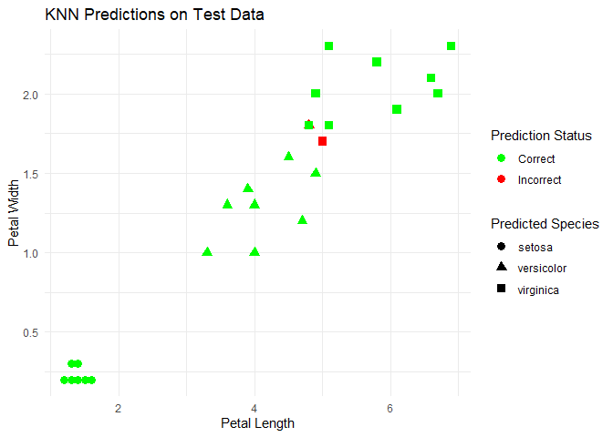

Peat vs Peat-Free substrates
================
HGF
2024-11-12

# KNN

So far in my Data Science career, the necessity for using ML models has
been few and far between (with the notable exception of RandomForest),

I decided I should probably expand my knowledge base and try some
methods to get up to scratch. Here i’ll be exploring KNN or K-nearest
neighbors.

## What is KNN?

KNN is a simple way for us to make assumptions based on data close to us
from clues, like saying if our neighbors houses have their window’s
open, we can assume its because of hot weather.

It’s effectively a classification model, wherein we’re calculating the
distance between one point of interest and all the others relevant to
it, and classifying those. In this instance, we’re applying KNN to the
iris dataset, and seeing if we can use the measurements of petal
shapes/widths etc. to determine species.

### Lets have a go

### Loading libraries and data

here we’ll be using some base R data, namely iris and class.

``` r
library(tibble)
library(class)
data(iris)
library(ggplot2)
```

``` r
# sampling the dataset
shuffled_indices <- sample(1:nrow(iris))
shuffled_iris <- iris[shuffled_indices, ]

# here we'll split the dataset for 80% training and 20% testing
train_size <- round(0.8 * nrow(shuffled_iris))
train_data <- shuffled_iris[1:train_size, ]
test_data <- shuffled_iris[(train_size + 1):nrow(shuffled_iris), ]

# here we're separating the features
train_X <- train_data[, -5] #cols 1-4
train_y <- train_data[, 5]   # the target variable, in this case 'species'
test_X <- test_data[, -5]    # all the features for testing
test_y <- test_data[, 5]     # labels for testing
```

``` r
# we're using K=3 here (no. of neighbors)
predicted_y <- knn(
  train = train_X,  # features for training
  test = test_X,    # features for testing
  cl = train_y,     # labels for the training data
  k = 3             
)
```

``` r
# computing the accuracy 
accuracy <- sum(predicted_y == test_y) / length(test_y)
cat("Accuracy:", accuracy, "\n")
```

    ## Accuracy: 0.9333333

``` r
# showing the confusion matrix
table(Predicted = predicted_y, Actual = test_y)
```

    ##             Actual
    ## Predicted    setosa versicolor virginica
    ##   setosa         11          0         0
    ##   versicolor      0          8         1
    ##   virginica       0          1         9

``` r
# trying no of neighbors as 5
predicted_y_k5 <- knn(train = train_X, test = test_X, cl = train_y, k = 5)

# accuracy for k=5
accuracy_k5 <- sum(predicted_y_k5 == test_y) / length(test_y)
cat("Accuracy with k=5:", accuracy_k5, "\n")
```

    ## Accuracy with k=5: 0.9333333

``` r
test_data$Predicted <- predicted_y
test_data$Correct <- ifelse(test_data$Predicted == test_data$Species, "Correct", "Incorrect")
```

### a wee scatterplot

Showing how the predictions of the test data suit the categorisations

``` r
ggplot(test_data, aes(x = Petal.Length, y = Petal.Width, color = Correct, shape = Predicted)) +
  geom_point(size = 3) +
  labs(
    title = "KNN Predictions on Test Data",
    x = "Petal Length",
    y = "Petal Width",
    color = "Prediction Status",
    shape = "Predicted Species"
  ) +
  theme_minimal() +
  scale_color_manual(values = c("Correct" = "green", "Incorrect" = "red"))
```

<!-- -->
