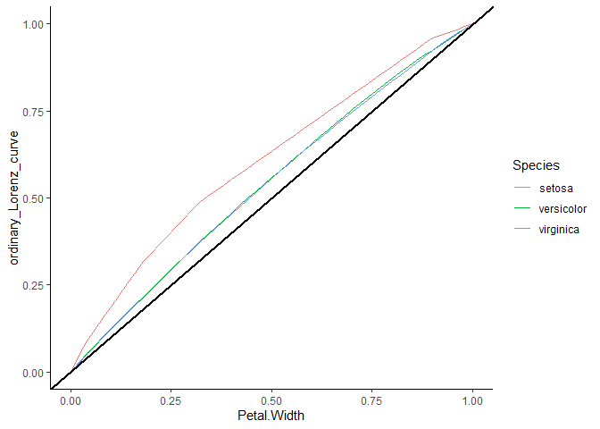

Gini and the Iris Dataset
================
HGF
2024-11-18

# Inequality in plant data

Something introduced to me while studying for my PhD was the application
of statistical models typically used for finance or demographics for
biological data.

The thinking was that plant trials tend to take a large series of
measurements, and that these plant populations and would demonstrate
potentially large discrepancies under different treatments.

The best way to observe these differences is to see how homogeneous or
indeed ‘unequal’ they are using these statistical models.

Here i’m going to apply the Gini Index to the Iris data set, and see if
we can build any insights.

# Libraries & data

``` r
library(gglorenz)
library(tidyverse)
library(ineq)
data(iris)
library(dplyr)
library(ggplot2)
library(rmarkdown)
```

## Gini

I’m interested in inequality. Typically one uses measurements of
inequality for looking at distribution of wealth/GDP etc. Here I’ll be
applying it to the iris data set.

The higher the gini value (0-1), the more unequal the data is, and
therefore, the less homogeneous.

``` r
head(iris)
```

    ##   Sepal.Length Sepal.Width Petal.Length Petal.Width Species
    ## 1          5.1         3.5          1.4         0.2  setosa
    ## 2          4.9         3.0          1.4         0.2  setosa
    ## 3          4.7         3.2          1.3         0.2  setosa
    ## 4          4.6         3.1          1.5         0.2  setosa
    ## 5          5.0         3.6          1.4         0.2  setosa
    ## 6          5.4         3.9          1.7         0.4  setosa

``` r
colnames(iris)
```

    ## [1] "Sepal.Length" "Sepal.Width"  "Petal.Length" "Petal.Width"  "Species"

``` r
cols_numeric <-iris[sapply(iris, is.numeric)]

gini_vals <- sapply(cols_numeric, function(col) ineq(col, type = "Gini"))

print(gini_vals)
```

    ## Sepal.Length  Sepal.Width Petal.Length  Petal.Width 
    ##   0.08042365   0.07915104   0.26148542   0.35926996

### Not much to say!

That doesn’t tell us much at all as we have a series of different
species in the dataset.

Different species will have different morphological traits. Lets get a
closer look at the homogeneity between species.

I’m going to actual make a function this time rather than have it as an
anonymous one.

``` r
cols_numeric <-iris[sapply(iris, is.numeric)]

gini_calc<-function(col){
    ineq(col, type = "Gini")
}

gini_species <- lapply(iris[1:4], function(col) {
    tapply(col, iris$Species, gini_calc)
    })

print(gini_species)
```

    ## $Sepal.Length
    ##     setosa versicolor  virginica 
    ## 0.03919297 0.04885445 0.05333333 
    ## 
    ## $Sepal.Width
    ##     setosa versicolor  virginica 
    ## 0.06016336 0.06320578 0.05887021 
    ## 
    ## $Petal.Length
    ##     setosa versicolor  virginica 
    ## 0.06344733 0.06101408 0.05514409 
    ## 
    ## $Petal.Width
    ##     setosa versicolor  virginica 
    ## 0.20861789 0.08256410 0.07587364

That’s great, we can now see each species gini values for each
morphological measurement, generally they all look very homogeneous. The
only outlier looks like Setosa with its Petal.Width at 0.2, whereas all
other values are \<0.01.

Lets graph it next to see how it looks.

``` r
ggplot(iris, aes(Petal.Width, color = Species), lwd = 1) +
stat_lorenz(desc = TRUE) +
geom_abline(linetype = "solid", color = "black", size=1) +
theme_classic()
```

<!-- -->

Here we can see the *45^o* abline representing 0, or ‘perfect equality’.
The further away from this line our Petal Width for each species is, the
less homogeneous (or ‘higher inequality’) that species petal width is.
Essentially, from our Gini value of 0.20861789 for Setosa, and our
graphing here with this Lorenz graph, we can say that the petal width of
this species is much more unequal than other species. A measurement like
this can be critical for manufacturing processes,
agriculture/horticulture and a myriad of other industries as it
identifies an element that falls outside the norm for producing
consistent results.
