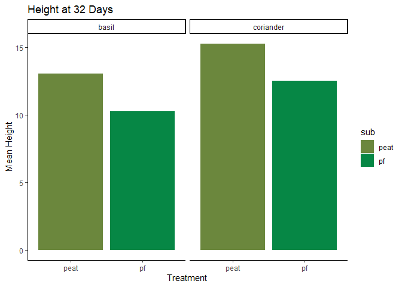
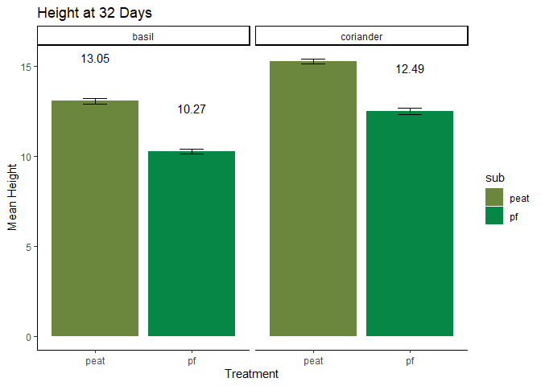
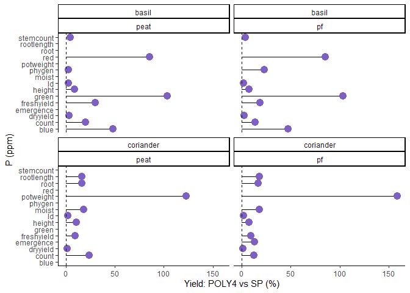
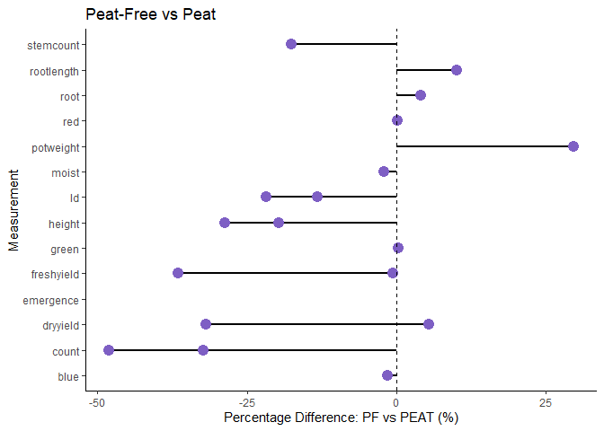

phd_data_rstudio
================
HGF
2024-11-12

setwd(“C:/Users/HGFea/Documents/Vs_code/phd”)

# Introduction

Here is some of my data from the PhD I did a few years back, at the time
I thought it would be great to write to whole thing in Markdown and
Latex.

That was a mistake.

I’m now having a look at my old data to try and observe some broad
themes for the project.

# libraries

``` r
library(ggplot2)
library(readxl)
library(Gini)
library(dplyr)
library(tidyr)
library(tidyverse)
```

# import files

I have two file types to work with, one being catagorical for
assessments, the other being a continous dataset.

``` r
df<-read_excel("2021cont.xlsx")
df_cat<-read_excel("2021cat.xlsx")
```

# Exploring the dataset

It’s been a few years since i’ve taken a look at this data, so lets have
a quick peek and see whats going on.

### N counts for each observation

Due to the way I laid out this data, I strongly suspect there will be
some missing values. I’ll also see how many observations I had per
treatment & experiment/trial. I’m doing this because the replicate
number is missing from this data - i’ll blame my past self for this
later.

``` r
summary(df)
```

    ##      exp              trtlong              crop               sub           
    ##  Length:14399       Length:14399       Length:14399       Length:14399      
    ##  Class :character   Class :character   Class :character   Class :character  
    ##  Mode  :character   Mode  :character   Mode  :character   Mode  :character  
    ##                                                                             
    ##                                                                             
    ##                                                                             
    ##                                                                             
    ##     amend           amendall           amf               comprate     
    ##  Length:14399       Mode:logical   Length:14399       Min.   :0.0000  
    ##  Class :character   NA's:14399     Class :character   1st Qu.:0.0000  
    ##  Mode  :character                  Mode  :character   Median :0.0000  
    ##                                                       Mean   :0.2974  
    ##                                                       3rd Qu.:0.5000  
    ##                                                       Max.   :2.0000  
    ##                                                                       
    ##       rb                 day          daycode              meau          
    ##  Length:14399       Min.   : 0.00   Length:14399       Length:14399      
    ##  Class :character   1st Qu.:14.00   Class :character   Class :character  
    ##  Mode  :character   Median :21.00   Mode  :character   Mode  :character  
    ##                     Mean   :21.84                                        
    ##                     3rd Qu.:32.00                                        
    ##                     Max.   :50.00                                        
    ##                                                                          
    ##      value            daynew       comprate2     
    ##  Min.   :  0.00   Min.   :  0.00   Mode:logical  
    ##  1st Qu.:  3.00   1st Qu.:  7.00   NA's:14399    
    ##  Median :  7.00   Median : 21.00                 
    ##  Mean   : 12.87   Mean   : 33.74                 
    ##  3rd Qu.: 13.00   3rd Qu.: 32.00                 
    ##  Max.   :187.00   Max.   :100.00                 
    ##  NA's   :1076     NA's   :7715

``` r
na_counts <- sapply(df, function(x) sum(is.na(x)))
print(na_counts)
```

    ##       exp   trtlong      crop       sub     amend  amendall       amf  comprate 
    ##         0       257         0         0      7523     14399         1         0 
    ##        rb       day   daycode      meau     value    daynew comprate2 
    ##       240         0      7731         0      1076      7715     14399

``` r
combo_counts <- df %>%
  count(exp, trtlong, meau, sub)

print(combo_counts)
```

    ## # A tibble: 548 × 5
    ##    exp   trtlong       meau       sub       n
    ##    <chr> <chr>         <chr>      <chr> <int>
    ##  1 e10   0.5comp PF    count      pf        6
    ##  2 e10   0.5comp PF    dryyield   pf        6
    ##  3 e10   0.5comp PF    freshyield pf        6
    ##  4 e10   0.5comp PF    height     pf       30
    ##  5 e10   0.5comp Peat  count      peat      6
    ##  6 e10   0.5comp Peat  dryyield   peat      6
    ##  7 e10   0.5comp Peat  freshyield peat      6
    ##  8 e10   0.5comp Peat  height     peat     30
    ##  9 e10   0.5compamf PF count      pf        6
    ## 10 e10   0.5compamf PF dryyield   pf        6
    ## # ℹ 538 more rows

As there are quite a few NA counts, mostly due to the data layout.
Rather than mutating it right away, i’d like to see if I can filter it
down to see some trends.

First thing i’ll do is check out some of the unique values in certain
cols. I split each observation type into a col called ‘meau’ (read:
**measurement**), I also know that ‘day’ will be important as certain
observations occur at set time intervals (like harvest for instance).

``` r
colnames(df)
```

    ##  [1] "exp"       "trtlong"   "crop"      "sub"       "amend"     "amendall" 
    ##  [7] "amf"       "comprate"  "rb"        "day"       "daycode"   "meau"     
    ## [13] "value"     "daynew"    "comprate2"

``` r
unique_list <- lapply(df %>% select(day, meau, sub, amend), unique)
print(unique_list)
```

    ## $day
    ##  [1] 32 50  7 21 14  0 28  1  2  5  3
    ## 
    ## $meau
    ##  [1] "count"      "freshyield" "height"     "dryyield"   "ld"        
    ##  [6] "blue"       "green"      "red"        "phygen"     "root"      
    ## [11] "emergence"  "moist"      "potweight"  "rootlength" "stemcount" 
    ## 
    ## $sub
    ## [1] "peat" "pf"   "pr"  
    ## 
    ## $amend
    ##  [1] NA            "none"        "amf"         "fert"        "0.5comp"    
    ##  [6] "0.5compamf"  "compfert"    "compfertamf" "1comp"       "1compamf"   
    ## [11] "2comp"       "2compamf"

We can now see a list of days and meau’s. Lets pick height and a certain
day to build a quick graph.

We’ll also filter for just ‘pf’ and ‘peat’ substrates, the ‘pr’ or
‘Peat-reduced’ wasn’t included after the first few trials.

``` r
unlist(unique(df$day))
```

    ##  [1] 32 50  7 21 14  0 28  1  2  5  3

``` r
# Lets filter out what we want to show!

df_height<-df%>%
        select(sub, meau, day, value, crop)%>%
        filter(sub == "peat" | sub == "pf", meau == 'height', day == "32")

# lets drop any NA values

df_height_clean <- df_height %>%
  filter(!is.na(value) & !is.infinite(value))

# I want to add a bit colour to my chart, so i'll need to factorise the 'sub' category first

df_height_clean2 <- df_height_clean %>%
  mutate(sub = factor(sub))


# and plotting

ggplot(df_height_clean2, aes(x = sub, y = value, fill = sub)) +
  geom_bar(position = "dodge", stat = "summary", fun = mean) +
  scale_fill_manual(values = c("peat" = "#6B873D", "pf" = "#068745")) +
  labs(x = "Treatment", y = "Mean Height") +
  ggtitle("Height at 32 Days")+
  facet_wrap(vars(crop))+
  theme_classic()
```

<!-- -->

Looks like the peat substrate is greater in height at day 32 for both
crop types. Lets add a bit more detail!

``` r
df_summary <- df_height_clean2 %>%
  group_by(sub, crop) %>%
  summarise(
    mean_value = mean(value, na.rm = TRUE),
    se_value = sd(value, na.rm = TRUE) / sqrt(n()),  
    n_count = n()  
  )


ggplot(df_summary, aes(x = sub, y = mean_value, fill = sub)) +
  geom_bar(position = "dodge", stat = "identity") +  
  scale_fill_manual(values = c("peat" = "#6B873D", "pf" = "#068745")) +
  geom_errorbar(aes(ymin = mean_value - se_value, ymax = mean_value + se_value), 
                position = position_dodge(width = 0.8), width = 0.25 ) + 
  geom_text(aes(label = round (mean_value, 2)), 
            position = position_dodge(width = 0.8), vjust = -4 ) +  
  labs(x = "Treatment", y = "Mean Height") +
  ggtitle("Height at 32 Days") +
  facet_wrap(vars(crop)) +
  theme_classic()
```

<!-- -->

Here i’ve added error bars and a mean value for each bar.

Now we’ve had a look at height at 32 days, lets have a quick look at the
other observations in ‘meau’

# Values within the treatments

``` r
# filtering and summing

df_sum <- df %>%
    filter(sub == "peat" | sub == "pf")%>%
    group_by(meau, crop, sub) %>%
    summarise(mean_val = mean(value, na.rm = TRUE), .groups = "drop")

ggplot(df_sum, aes(x = mean_val, y = meau)) +
    geom_segment(aes(x = 0, y = meau, xend = mean_val, yend = meau)) + 
    geom_point(color = "#7e5fc4", size = 4) +
    theme_classic() +
    geom_vline(xintercept = 0, linetype = "dashed") +
    labs(x = "Yield: POLY4 vs SP (%)", y = "P (ppm)") + 
    facet_wrap(vars(crop, sub))
```

<!-- -->

\# lets get some interesting differences

``` r
# calculating the means and dropping phygen (phygen is damage to leaves usualy from p&d, very little recorded so is being dropped)

df_sum <- df %>%
  filter(sub == "peat" | sub == "pf", meau != "phygen") %>%
  group_by(meau, crop, sub) %>%
  summarise(mean_val = mean(value, na.rm = TRUE), .groups = "drop")

# just a quick pivot

df_spread <- df_sum %>%
  pivot_wider(names_from = sub, values_from = mean_val) %>%
  mutate(
    pct_diff = (pf - peat) / peat * 100 
  )


#head(df_spread)

ggplot(df_spread, aes(x = pct_diff, y = meau)) +
  geom_segment(aes(x = 0, y = meau, xend = pct_diff, yend = meau), size = 1) + 
  geom_point(color = "#7e5fc4", size = 4) +
  theme_classic() +
  geom_vline(xintercept = 0, linetype = "dashed") +  
  labs(x = "Percentage Difference: PF vs PEAT (%)", y = "Measurement") + 
  ggtitle("Peat-Free vs Peat")
```

<!-- -->

``` r
  facet_wrap(vars(crop))  
```

    ## <ggproto object: Class FacetWrap, Facet, gg>
    ##     compute_layout: function
    ##     draw_back: function
    ##     draw_front: function
    ##     draw_labels: function
    ##     draw_panels: function
    ##     finish_data: function
    ##     init_scales: function
    ##     map_data: function
    ##     params: list
    ##     setup_data: function
    ##     setup_params: function
    ##     shrink: TRUE
    ##     train_scales: function
    ##     vars: function
    ##     super:  <ggproto object: Class FacetWrap, Facet, gg>

This graph is showing us the % difference for each measurement between
peat and peat-free. As we can see, generally peat-free is performing
poorly in most measurements, except for a rather intersting case in dry
yield and rootlength.

## Old data

# Pivoting the dataset

Building two col values for the substrate types ‘Peat’ & ‘pf’

``` r
df_wide <- df %>%
    pivot_wider(
        names_from = sub,
        values_from = value,
        values_fn = list(value = mean)  # Replace `mean` with another function if needed
    )
```

``` r
df_long <- df_cat %>%
    pivot_longer(
        cols = c(
            height,
            count, 
            freshyield,
            dryyield, 
            ld, 
            rootlength,
            potweight,
            moist,
            stemcount,
            phygen, 
            red, 
            green,
            blue
        ),
        names_to = "sub2",          # Corrected placement of `names_to`
        values_to = "value"         # Corrected placement of `values_to`
    )
```

# Generating a % difference between substrate types

``` r
df_long <- df_cat %>%
    rename(meau_original = meau) %>%  
    pivot_longer(
        cols = c(height, count, freshyield, dryyield, ld, rootlength, potweight,
                 moist, stemcount, phygen, red, green, blue),
        names_to = "meau",           
        values_to = "value"         
    ) %>%
    pivot_wider(
        names_from = sub,            
        values_from = value,         
        values_fn = list(value = mean)  
    )

df_long2 <- df_long %>%
    mutate(diff_pf_peat = peat - pf)  


new_diff<- df_long2%>%
        group_by(meau,crop,)
```
