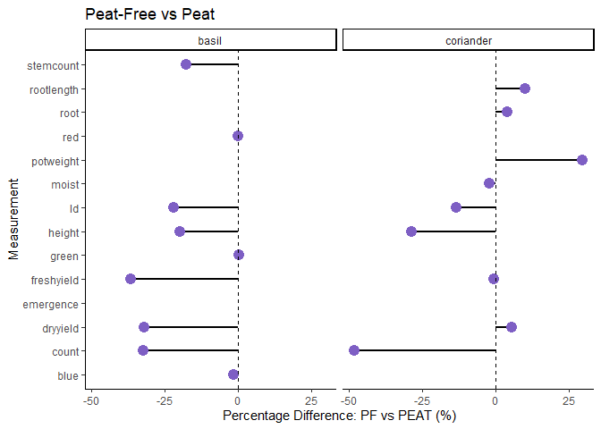
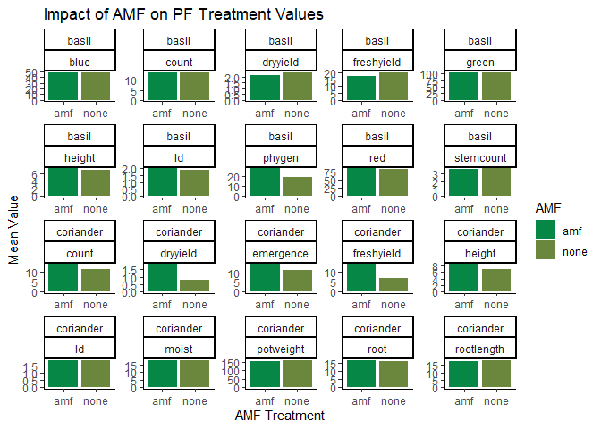

Peat vs Peat-Free substrates
================
HGF
2024-11-12

setwd(“C:/Users/HGFea/Documents/Vs_code/phd”)

# Introduction

Here is some of my data from the PhD I did a few years back, at the time
I thought it would be great to write to whole thing in Markdown and
Latex.

That was a mistake.

I’m now having a look at my old data to try and observe some broad
themes for the project.

### libraries

``` r
library(ggplot2)
library(readxl)
library(Gini)
library(dplyr)
library(tidyr)
library(tidyverse)
```

### import files

I have two file types to work with, one being categorical for
assessments, the other being a continuous dataset.

``` r
df<-read_excel("2021cont.xlsx")
df_cat<-read_excel("2021cat.xlsx")
```

# Exploring the dataset

It’s been a few years since i’ve taken a look at this data, so lets have
a quick peek and see whats going on.

``` r
head(df)
```

    ## # A tibble: 6 × 15
    ##   exp   trtlong  crop  sub   amend amendall amf   comprate rb      day daycode
    ##   <chr> <chr>    <chr> <chr> <chr> <lgl>    <chr>    <dbl> <chr> <dbl> <chr>  
    ## 1 e10   con Peat basil peat  <NA>  NA       none         0 none     32 M      
    ## 2 e10   con Peat basil peat  <NA>  NA       none         0 none     32 M      
    ## 3 e10   con Peat basil peat  <NA>  NA       none         0 none     32 M      
    ## 4 e10   con Peat basil peat  <NA>  NA       none         0 none     32 M      
    ## 5 e10   con Peat basil peat  <NA>  NA       none         0 none     32 M      
    ## 6 e10   con Peat basil peat  <NA>  NA       none         0 none     32 M      
    ## # ℹ 4 more variables: meau <chr>, value <dbl>, daynew <dbl>, comprate2 <lgl>

Due to the way I laid out this data, I strongly suspect there will be
some missing values. I’ll also see how many observations I had per
treatment & experiment/trial. I’m doing this because the replicate
number is missing from this data - i’ll blame my past self for this
later.

``` r
na_counts <- sapply(df, function(x) sum(is.na(x)))
print(na_counts)
```

    ##       exp   trtlong      crop       sub     amend  amendall       amf  comprate 
    ##         0       257         0         0      7523     14399         1         0 
    ##        rb       day   daycode      meau     value    daynew comprate2 
    ##       240         0      7731         0      1076      7715     14399

``` r
combo_counts <- df %>%
  count(exp, trtlong, meau, sub)
head(combo_counts)
```

    ## # A tibble: 6 × 5
    ##   exp   trtlong      meau       sub       n
    ##   <chr> <chr>        <chr>      <chr> <int>
    ## 1 e10   0.5comp PF   count      pf        6
    ## 2 e10   0.5comp PF   dryyield   pf        6
    ## 3 e10   0.5comp PF   freshyield pf        6
    ## 4 e10   0.5comp PF   height     pf       30
    ## 5 e10   0.5comp Peat count      peat      6
    ## 6 e10   0.5comp Peat dryyield   peat      6

As there are quite a few NA counts, mostly due to the data layout.
Rather than mutating it right away, i’d like to see if I can filter it
down to see some trends.

The counts for each trt_long & meau is also quite useful, it’s telling
me how many observations I have per assessment (such as count etc.).

First thing i’ll do is check out some of the unique values in certain
cols. I split each observation type into a col called ‘meau’ (read:
**measurement**), I also know that ‘day’ will be important as certain
observations occur at set time intervals (like harvest for instance).

``` r
colnames(df)
```

    ##  [1] "exp"       "trtlong"   "crop"      "sub"       "amend"     "amendall" 
    ##  [7] "amf"       "comprate"  "rb"        "day"       "daycode"   "meau"     
    ## [13] "value"     "daynew"    "comprate2"

``` r
unique_list <- lapply(df %>% select(day, meau, sub, amend), unique)
print(unique_list)
```

    ## $day
    ##  [1] 32 50  7 21 14  0 28  1  2  5  3
    ## 
    ## $meau
    ##  [1] "count"      "freshyield" "height"     "dryyield"   "ld"        
    ##  [6] "blue"       "green"      "red"        "phygen"     "root"      
    ## [11] "emergence"  "moist"      "potweight"  "rootlength" "stemcount" 
    ## 
    ## $sub
    ## [1] "peat" "pf"   "pr"  
    ## 
    ## $amend
    ##  [1] NA            "none"        "amf"         "fert"        "0.5comp"    
    ##  [6] "0.5compamf"  "compfert"    "compfertamf" "1comp"       "1compamf"   
    ## [11] "2comp"       "2compamf"

We can now see a list of days and meau’s. Lets pick height and a certain
day to build a quick graph.

We’ll also filter for just ‘pf’ and ‘peat’ substrates, the ‘pr’ or
‘Peat-reduced’ wasn’t included after the first few trials.

``` r
unlist(unique(df$day))
```

    ##  [1] 32 50  7 21 14  0 28  1  2  5  3

``` r
# Lets filter out what we want to show!

df_height<-df%>%
        select(sub, meau, day, value, crop)%>%
        filter(sub == "peat" | sub == "pf", meau == 'height', day == "32")

# lets drop any NA values

df_height_clean <- df_height %>%
  filter(!is.na(value) & !is.infinite(value))

# I want to add a bit colour to my chart, so i'll need to factorise the 'sub' category first

df_height_clean2 <- df_height_clean %>%
  mutate(sub = factor(sub))


# and plotting

ggplot(df_height_clean2, aes(x = sub, y = value, fill = sub)) +
  geom_bar(position = "dodge", stat = "summary", fun = mean) +
  scale_fill_manual(values = c("peat" = "#6B873D", "pf" = "#068745")) +
  labs(x = "Treatment", y = "Mean Height") +
  ggtitle("Height at 32 Days")+
  facet_wrap(vars(crop))+
  theme_classic()
```

<!-- -->

Looks like the peat substrate is greater in height at day 32 for both
crop types. Lets add a bit more detail!

``` r
df_summary <- df_height_clean2 %>%
  group_by(sub, crop) %>%
  summarise(
    mean_value = mean(value, na.rm = TRUE),
    se_value = sd(value, na.rm = TRUE) / sqrt(n()),  
    n_count = n()  
  )


ggplot(df_summary, aes(x = sub, y = mean_value, fill = sub)) +
  geom_bar(position = "dodge", stat = "identity") +  
  scale_fill_manual(values = c("peat" = "#6B873D", "pf" = "#068745")) +
  geom_errorbar(aes(ymin = mean_value - se_value, ymax = mean_value + se_value), 
                position = position_dodge(width = 0.8), width = 0.25 ) + 
  geom_text(aes(label = round (mean_value, 2)), 
            position = position_dodge(width = 0.8), vjust = -4 ) +  
  labs(x = "Treatment", y = "Mean Height") +
  ggtitle("Height at 32 Days") +
  facet_wrap(vars(crop)) +
  theme_classic()
```

<!-- -->

Here i’ve added error bars and a mean value for each bar.

Now we’ve had a look at height at 32 days, lets have a quick look at the
other observations in ‘meau’

# Observations

Lets have a look at some of the other observations and see if we can
spot any trends.

Now lets see if we can refine those differences to get some clarity,
first thing we can do is normalize the data by putting it on a % scale,
and subtracting the values for each measurement based on ‘peat-free -
peat’,

``` r
# calculating the means and dropping phygen (phygen is damage to leaves usual from p&d, very little recorded so is being dropped)

df_sum <- df %>%
  filter(sub == "peat" | sub == "pf", meau != "phygen") %>%
  group_by(meau, crop, sub) %>%
  summarise(mean_val = mean(value, na.rm = TRUE), .groups = "drop")

# just a quick pivot

df_spread <- df_sum %>%
  pivot_wider(names_from = sub, values_from = mean_val) %>%
  mutate(pct_diff = (pf - peat) / peat * 100 )


#head(df_spread)

ggplot(df_spread, aes(x = pct_diff, y = meau)) +
  geom_segment(aes(x = 0, y = meau, xend = pct_diff, yend = meau), size = 1) + 
  geom_point(color = "#7e5fc4", size = 4) +
  theme_classic() +
  geom_vline(xintercept = 0, linetype = "dashed") +  
  labs(x = "Percentage Difference: PF vs PEAT (%)", y = "Measurement") + 
  ggtitle("Peat-Free vs Peat")+
  facet_wrap(vars(crop))  
```

<!-- -->

This graph is showing us the % difference for each measurement between
peat and peat-free. As we can see, generally peat-free is performing
poorly in most measurements, except for a rather interesting case in dry
yield and root length in Coriander. Generally the peat substrate
outperforms the peat-free in basil, but this story is a bit more complex
with Coriander.

Next we’re going to look at the treatment side of the project. This was
to see if the addition of microbial amendments (like fungi, in this case
*Mychorriza*) could enhance the growth in peat-free substrates.

## Treatments

Lets start by filtering for our required parameters, peat-free (‘pf’)
and if it has amf or not.

``` r
df_pf_amf <- df %>%
  filter(sub == "pf", amf == "none" | amf== "amf") %>%
  group_by(meau, crop, amf) %>%
  summarise(mean_val = mean(value, na.rm = TRUE), .groups = "drop")

# simple bar charts, facted by crop type and measurement/observation

ggplot(df_pf_amf, aes(x = amf, y = mean_val, fill = amf)) +
  geom_bar(stat = "identity", position = "dodge") +  
  scale_fill_manual(values = c("none" = "#6B873D", "amf" = "#068745")) +  
  labs(x = "AMF Treatment", y = "Mean Value", fill = "AMF") +
  ggtitle("Impact of AMF on PF Treatment Values") +
  facet_wrap(vars(crop, meau), scales = 'free') + 
  theme_classic()
```

<!-- -->

This looks a bit busy for my liking, lets bring in our previous code for
our lolipops and get the % difference between amf treatments and
controls (i.e. none).

Lets also filter out a few measurements.

``` r
df2<-df%>%filter(!meau %in% c("blue", "green", "red", "moist", "phygen", "potweight", "root", "rootlength", "stemcount"))

df_pf_amf <- df2 %>%
  filter(sub == "pf") %>%
  group_by(meau, crop, amf) %>%
  summarise(mean_val = mean(value, na.rm = TRUE), .groups = "drop")


df_diff <- df_pf_amf %>%
  pivot_wider(names_from = amf, values_from = mean_val) %>%
  mutate(diff = (amf - none) /none *100)  


ggplot(df_diff, aes(x = diff, y = meau)) +
  geom_segment(aes(x = 0, y = meau, xend = diff, yend = meau), size = 1) + 
  geom_point(color = "#7e5fc4", size = 4) +
  theme_classic() +
  geom_vline(xintercept = 0, linetype = "dashed") +  
  labs(x = "Percentage Difference: control vs amf", y = "Measurement") + 
  ggtitle("Control vs AMF")+
  facet_wrap(vars(crop)) 
```

<!-- -->

That looks much better, now we can see that the impact of treating
peat-free substrate with AMF greatly increases several growth
characteristics in Coriander, just not basil.
