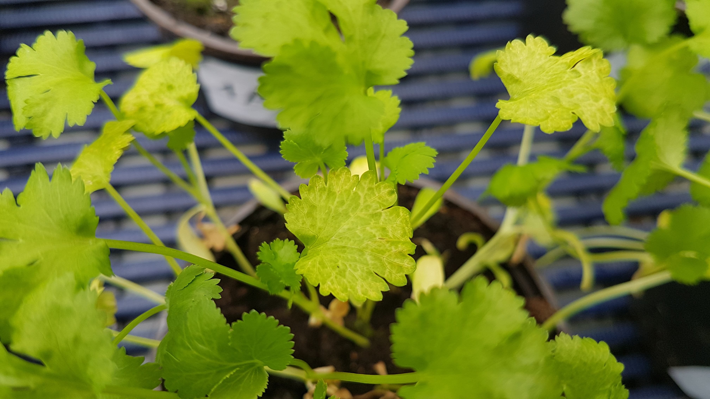

# Harry Featherstone
### Data Scientist

# About Me

I've spent the last couple of years working as a data scientist for AngloAmerican, where we've been building the ground for a new fertiliser product 'POLY4'. My role there is quite broad and always exciting. I work within sales and marketing, helping answer the questions from clients and our agronomists through powerful statistical analysis, visuals, dashboards, modeling etc. Anything needed to generate that extra value from our data!

I also spent the years before that completing a PhD. This was focused on improving peat-free growing media for potted herbs (think the basil plants you'd buy in the supermarket). It was during this period I found the benefits of programming and haven't looked back since.

# Projects

**Project 1**

*Peat-Free vs Peat; biological amendments* [R]

This is a quick look at some of my PhD data, I wanted to remind myself of how it looked, and to pull out some broad themes from the results.

[Github](https://github.com/HGfeatherz/HGfeatherz.github.io/tree/main/projects/phd_data_rstudio.md)

**Project 2**

*KNN* [R]

A foray into ML models, looking at the iris dataset for categorising plant species using K-clustering

[Github](https://github.com/HGfeatherz/HGfeatherz.github.io/tree/main/projects/KNN_r.md)

**Project 3**

*Map of London* [Python]

Typically I use R or Qgis for GIS purposes, but I found a really simple tutorial online so thought i'd give it a go.

[Github](https://github.com/HGfeatherz/HGfeatherz.github.io/tree/main/projects/map_of_ldn.ipynb)

**Project 4**

*PDF scanner* [Python]

I needed to find some documents with keywords in them, this is a scanner for pdf files.

[Github](https://github.com/HGfeatherz/HGfeatherz.github.io/tree/main/projects/pdf_scan.ipynb)

**Project 5**

*Gini index* [R]

I wanted to demonstrate the potential for interepreting biological data through a different lense. Here
I use the Iris data and a modeling system typically applied to financial data.

[Github](https://github.com/HGfeatherz/HGfeatherz.github.io/tree/main/projects/gini_rstudio.html)