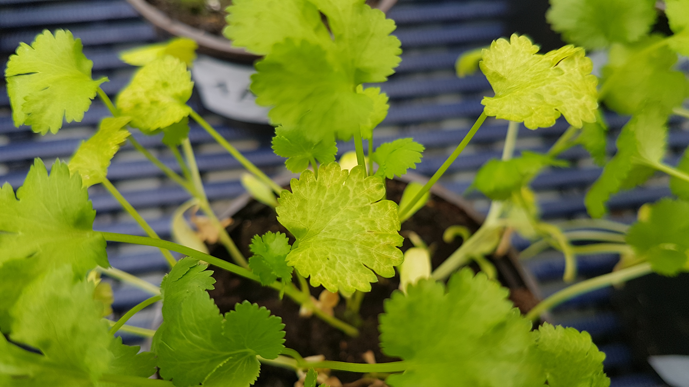

# Harry Featherstone
### Data Scientist/Analyst

# About Me

I've spent the past few years working as a Data Scientist for AngloAmerican (agriculture/crop nutrients) and more recently a Data Analyst at McCain Foods (FMCG).
Over the course of the past few years, i've built a variety of skills that i'm hoping to show here. This is just a small collection of ideas and interests I have, feel free to have a look at the README's and send a message with any questions.
I have particular interest in homelabbing currently (turns out running postgres on a headless pi cluster is quite straightforward) as well as automating processes (thank you whoever made cron on linux).

# Projects

**Project 1**

*Peat-Free vs Peat; biological amendments* [R]

This is a quick look at some of my PhD data, I wanted to remind myself of how it looked, and to pull out some broad themes from the results.

[Github](https://github.com/HGfeatherz/HGfeatherz.github.io/tree/main/projects/phd_data_rstudio.md)

**Project 2**

*KNN* [R]

A foray into ML models, looking at the iris dataset for categorising plant species using K-clustering

[Github](https://github.com/HGfeatherz/knn-classification-analysis)

**Project 3**

*Map of London* [Python]

Typically I use R or Qgis for GIS purposes, but I found a really simple tutorial online so thought i'd give it a go.

[Github](https://github.com/HGfeatherz/HGfeatherz.github.io/tree/main/projects/map_of_ldn.ipynb)

**Project 4**

*Gini index* [R]

I wanted to demonstrate the potential for interepreting biological data through a different lense. Here
I use the Iris data and a modeling system typically applied to financial data.

[Github](https://github.com/HGfeatherz/gini-inequality/blob/main/README.md)

**Project 5**

*OEE* [Python]

Here I look at some Overall Operating Efficency data. 

[Github](https://github.com/HGfeatherz/HGfeatherz.github.io/tree/main/projects/oee.ipynb)

